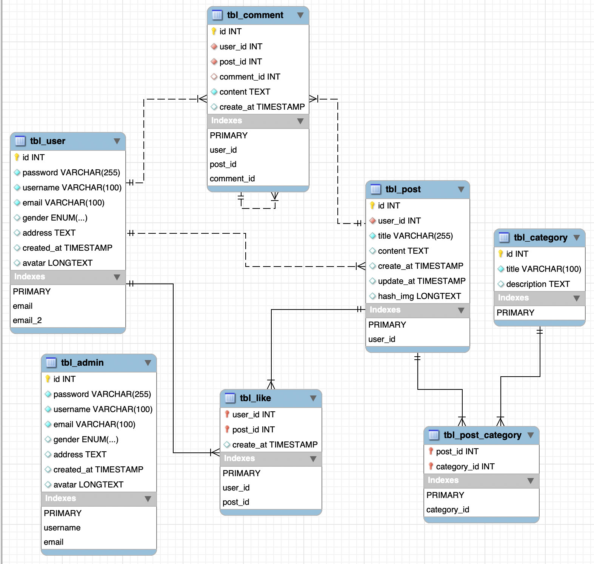

# Thiết kế database

- [db.drawio](./db.drawio)
- [db.sql](./db.sql)
- [db.png](./db.png)

#### Để có thể xem và chỉnh sửa nội dung của `db.drawio`
1. Cài đặt vscode extension [Draw.io Integration](https://marketplace.visualstudio.com/items?itemName=hediet.vscode-drawio) 
2. Sử dụng trực tiếp trên trang web [draw.io](https://app.diagrams.net/)

#### Database của Blog website

<br>
<br>

# Mục lục

[1. Định dạng response](#1)<br>
[2. Mô tả userRoute](#2)<br>
&emsp;[2.1. Đăng nhập](#2.1)<br>
&emsp;[2.2. Đăng ký tài khoản](#2.2)<br>
&emsp;[2.3. Cập nhập tài khoản](#2.3)<br>
&emsp;[2.4. Xóa tài khoản theo username](#2.4)<br>
&emsp;[2.5. Xóa tài khoản theo id](#2.5)<br>
&emsp;[2.6. Lấy danh sách tất cả user](#2.6)<br>
[3. Mô tả adminRoute](#3)<br>
&emsp;[3.1. Đăng nhập](#3.1)<br>
&emsp;[3.2. Cập nhập theo email](#3.2)<br>
[4. Mô tả postRoute](#4)<br>
&emsp;[4.1. Tạo post](#4.1)<br>
&emsp;[4.2. Cập nhật post theo `id`](#4.2)<br>
&emsp;[4.3. Xóa post theo `id`](#4.3)<br>
&emsp;[4.4. Tìm kiếm post theo `id`](#4.4)<br>
&emsp;[4.5. Tìm kiếm các post theo `title`](#4.5)<br>
&emsp;[4.6. Tìm kiếm các post theo `create_at`](#4.6)<br>
&emsp;[4.7. Tìm kiếm các post theo `author_dipslay_name`](#4.7)<br>
&emsp;[4.8. Tìm kiếm các post theo `category_title`](#4.8)<br>
&emsp;[4.9. Tìm kiếm tất cả các `post`](#4.9)<br>
&emsp;[4.10. Tìm kiếm tất cả các `post` của `user` theo `user_id`](#4.10)<br>
[5. Mô tả categoryRoute](#5)<br>
&emsp;[5.1. Tìm kiếm category theo `id`](#5.1)<br>
&emsp;[5.2. Tìm kiếm các category theo `title`](#5.2)<br>
&emsp;[5.3. Tìm kiếm các category theo `post_id`](#5.3)<br>
&emsp;[5.4. Cập nhật `post category` theo `id`](#5.4)<br>
&emsp;[5.5. Lấy tất cả các `category`](#5.5)<br>
[6. Mô tả commentRoute](#6)<br>
&emsp;[6.1. Tìm kiếm comment theo `id`](#6.1)<br>
&emsp;[6.2. Tạo mới comment](#6.2)<br>
&emsp;[6.3. Xóa comment theo `id`](#6.3)<br>
&emsp;[6.4. Cập nhật comment theo `id`](#6.4)<br>
[7. Mô tả likeRoute](#7)<br>
&emsp;[7.1. Tìm kiếm `like` theo `user_id`](#7.1)<br>
&emsp;[7.2. Tìm kiếm `like` theo `post_id`](#7.2)<br>
&emsp;[7.3. Tìm kiếm `like` theo `user_id` và `post_id`](#7.3)<br>
&emsp;[7.4. Thêm `like` theo `user_id` và `post_id`](#7.4)<br>
&emsp;[7.5. Xóa `like` theo `user_id` và `post_id`](#7.5)<br>


# 1. Định dạng response <a id="1"></a>

> Xem xét <span style="color:yellow">reponsce `code` bằng 200 hay 500</span> trước khi thực hiện các thao tác tiếp theo.
> - `code` = 200, response được gửi thành công mà không có lỗi xảy ra ở server.
>
> - `code` = 500, response được gửi khi server bắt được lỗi trong try...catch

### <span style="color:green">Thành công</span>

```json
{
    code: 200,
    detail: {
        ... // các thông tin bổ sung
    }
}
```

### <span style="color:red">Thất bại</span>

```json
{
    code: 500, // qui ước 500 là xảy ra lỗi tại server
    message: ... // mô tả lỗi
}
```

<br>
<br>

# 2. Mô tả user route ([userRoute.js](./src/routes/userRoute.js)) <a id="2"></a>

### 2.1 Đăng nhập <a id='2.1'></a>
```json
[POST] http://localhost:9999/api/user
{
    "email": "user1@example.com",
    "password": "1234"
}
```

<span style="color:green">Response</span>

```json
{
    "code": 200,
    "detail": {
        "id": 1,
        "password": "1234",
        "username": "john_doe",
        "email": "john@example.com",
        "gender": "Male",
        "address": "123 Main St, City",
        "created_at": "2024-10-09T04:00:30.000Z"
    }
}
```

<span style="color:red">Response đăng nhập thất bại do không tồn tại `username`</span>

```json
{
    "code": 200,
    "detail": null
}
```

<span style="color:red">Response đăng nhập thất bại do tồn tại `username` nhưng `password` không đúng</span>

```json
{
    "code": 200,
    "detail": {
        "password": false
    }
}
```

<br>

### 2.2 Đăng ký tài khoản <a id="2.2"></a>
```json
[PUT] http://localhost:9999/api/user
{
    "email": "abc@example.com",
    "username": "john_doe",
    "password": "1234",
}
```

<span style="color:green">Response đăng ký thành công</span>

```json
{
    "code": 200,
    "detail": {
        "insertId": 11,
        "affectedRows": 1
    }
}
```

<span style="color:red">Response đăng ký thất bại</span>
```
{
    "code": 500,
    "message": "Duplicate entry 'john_doe' for key 'tbl_user.username'"
}
```

<br>

### 2.3 Cập nhập tài khoản <a id="2.3"></a>
- <span style="color:yellow">Bắt buộc phải có field `email`, server dùng `email` để định danh user được cập nhật.</span>

```json
[PATCH] http://localhost:9999/api/user
{
    "email": "user2@gmail.com",
    "username": "user2",
    "password": "1234",
    "gender": null,
    "address": null,
    "avatar": "..."
}
```

<span style="color:green">Response cập thành công</span>

```json
{
    "code": 200,
    "detail": {
        "affectedRows": 1
    }
}
```

<span style="color:red">Response cập thất bại, thất bại do trùng email với user khác</span>

```json
{
    "code": 500,
    "message": "Duplicate entry 'user2@gmail.com' for key 'tbl_user.email'"
}
```

<br>

### 2.4 Xóa tài khoản theo `username` <a id="2.4"></a>
```json
[DELETE] http://localhost:9999/api/user
{
    "username": "user1"
}
```

<span style="color:green">Response xóa thành công</span>

```json
{
    "code": 200,
    "detail": {
        "affectedRows": 1
    }
}
```

<span style="color:red">Response xóa thất bại, có thể do không tồn tại username tương ứng</span>

```json
{
    "code": 200,
    "detail": {
        "affectedRows": 0
    }
}
```

<br>

### 2.5 Xóa tài khoản theo `id` <a id="2.5"></a>
```json
[DELETE] http://localhost:9999/api/user/:id
Ví dụ: [DELETE] http://localhost:9999/api/user/123
{
}
```

<span style="color:green">Response xóa thành công</span>

```json
{
    "code": 200,
    "detail": {
        "affectedRows": 1
    }
}
```

<span style="color:red">Response xóa thất bại, có thể do không tồn tại id tương ứng</span>

```json
{
    "code": 200,
    "detail": {
        "affectedRows": 0
    }
}
```

<br>

### 2.6 Lấy danh sách tất cả user <a id="2.6"></a>
- Cân nhắc chuyện có trả về `password` hay không sau.

```json
[GET] http://localhost:9999/api/user
{
}
```

<span style="color:green">Response thành công</span>

```json
{
    "code": 200,
    "detail": [
        {
            "id": 1,
            "password": "1234",
            "username": "john_doe",
            "email": "john@example.com",
            "gender": "Male",
            "address": "123 Main St, City",
            "created_at": "2024-10-09T04:00:30.000Z"
        },
        {
            "id": 2,
            "password": "1234",
            "username": "jane_doe",
            "email": "jane@example.com",
            "gender": "Female",
            "address": "456 Market St, City",
            "created_at": "2024-10-09T04:00:30.000Z"
        },
        {
            "id": 3,
            "password": "1234",
            "username": "alex_smith",
            "email": "alex@example.com",
            "gender": "Other",
            "address": "789 Broadway Ave, City",
            "created_at": "2024-10-09T04:00:30.000Z"
        },
        ...
    ]
}
```

<br>
<br>

# 3. Mô tả admin route ([adminRoute.js](./src/routes/adminRoute.js)) <a id="3"></a>

### 3.1 Đăng nhập <a id="3.1"></a>

```json
[POST] http://localhost:9999/api/admin
{
    "email": "email@example.com",
    "password": "1234"
}
```

<span style="color:green">Response thành công</span>

```json
{
    "code": 200,
    "detail": {
        "id": 3,
        "username": "admin",
        "email": "adminjohn123@example.com",
        "gender": "Male",
        "address": "123 Admin St, City",
        "created_at": "2024-10-09T04:00:34.000Z"
    }
}
```

<span style="color:red">Response đăng nhập thất bại do không tồn tại `username`</span>

```json
{
    "code": 200,
    "detail": null
}
```

<span style="color:red">Response đăng nhập thất bại do tồn tại `username` nhưng `password` không đúng</span>

```json
{
    "code": 200,
    "detail": {
        "password": false
    }
}
```

<br>

### 3.2 Cập nhật theo email <a id="3.2"></a>

```json
[PATCH] http://localhost:9999/api/admin
{
    // tương tự cập nhật user
}
```

<br>
<br>

# 4. Mô tả post route ([postRoute.js](./src/routes/postRoute.js)) <a id="4"></a>

### 4.1 Tạo post <a id="4.1"></a>

```json
[PUT] http://localhost:9999/api/post
{
    "userId": "13",
    "title": "Tiêu đề của bài blog",
    "content": "......",
    "hashImg": "......",
}
```

<span style="color:green">Response thành công</span>

```json
{
    "code": 200,
    "detail": {
        "insertId": 15,
        "affectedRows": 1
    }
}
```

<span style="color:red">Response thất bại</span>

```json
{
    "code": 500,
    "message": "Cannot add or update a child row: a foreign key constraint fails (`BlogDB`.`tbl_post`, CONSTRAINT `tbl_post_ibfk_1` FOREIGN KEY (`user_id`) REFERENCES `tbl_user` (`id`) ON DELETE CASCADE)"
}
```

<br>

### 4.2 Cập nhật post theo `id` <a id="4.2"></a>

- <span style="color:yellow">Bắt buộc phải có field `id`, server dùng `id` để định danh post được cập nhật.</span>
- Các field được set giá trị `null` hoặc không xuất hiện trong mô tả được xem mặc định là `null`.
- Các field `null` sẽ bị loại bỏ ở server.
- Chỉ cung cấp 4 field bên dưới cho việc cập nhật thông tin. <span style="color:yellow">Có thể cung cấp thiếu nhưng không được sai tên.</span>
- Các field không khớp với các field sau sẽ bị xem là không hợp lệ.

```json
[PATCH] http://localhost:9999/api/post/12
{
    "userId": 13,
    "title": "new title",
    "content": "Lorem Ipsum is simply dummy text of the printing and typesetting industry.",
    "hashImg": "hash_img_123"
}
```

<span style="color:green">Response thành công</span>

```json
{
    "code": 200,
    "detail": {
        "affectedRows": 1
    }
}
```

<span style="color:red">Response thất bại do không có post nào có id=`id`</span>

```json
{
    "code": 200,
    "detail": {
        "affectedRows": 0
    }
}
```

<span style="color:red">Response thất bại do không tồn tại user có id=`id`</span>

```json
{
    "code": 500,
    "message": "Cannot add or update a child row: a foreign key constraint fails (`BlogDB`.`tbl_post`, CONSTRAINT `tbl_post_ibfk_1` FOREIGN KEY (`user_id`) REFERENCES `tbl_user` (`id`) ON DELETE CASCADE)"
}
```

<br>

### 4.3 Xóa post theo `id` <a id="4.3"></a>

```json
[DELETE] http://localhost:9999/api/post/13
{
}
```

<span style="color:green">Response thành công</span>

```json
{
    "code": 200,
    "detail": {
        "affectedRows": 1
    }
}
```

<span style="color:red">Response thất bại do không tồn tại bài post nào có id=`id`</span>

```json
{
    "code": 200,
    "detail": {
        "affectedRows": 0
    }
}
```

<br>

### 4.4 Tìm kiếm post theo `id` <a id="4.4"></a>

#### Path: [GET] http://localhost:9999/api/post/:id

```json
[GET] http://localhost:9999/api/post/1
{
}
```

<span style="color:green">Response thành công</span>

```json
{
    "code": 200,
    "detail": {
        "id": 1,
        "user_id": 1,
        "title": "My First Post",
        "content": "This is the content of my first post!",
        "create_at": "2024-10-09T04:00:47.000Z",
        "update_at": "2024-10-09T04:00:47.000Z"
    }
}
```

<span style="color:red">Response thất bại do không tìm thấy `id` tương ứng</span>

```json
{
    "code": 200,
    "detail": null
}
```

<br>

### 4.5 Tìm kiếm các post theo `title` <a id="4.5"></a>

- `value`: tìm kiếm các bài post có `title` chứa `value`
- `sort`: sắp xếp theo `title` tăng dần hoặc giảm dần
- <span style="color:yellow">`value` bắt buộc phải có, không có sẽ báo lỗi</span>
- <span style="color:yellow">`sort` có thể có hoặc không</span>, giá trị bằng `1` hoặc `-1` (`1` nếu sắp xếp tăng dần, `-1` nếu giảm dần)

```json
[GET] http://localhost:9999/api/post/search/title?value=1&sort=1
[GET] http://localhost:9999/api/post/search/title?value=gia tri can tim
{
}
```

<span style="color:green">Response thành công</span>

```json
{
    "code": 200,
    "detail": [
        {
            "id": 10,
            "user_id": 13,
            "title": "title 1",
            "content": "noi dung ne",
            "create_at": "2024-10-10T10:23:06.000Z",
            "update_at": "2024-10-10T10:23:34.000Z"
        },
        {
            "id": 3,
            "user_id": 3,
            "title": "Top 10 Tech Gadgets of 2024",
            "content": "Check out the top gadgets of this year.",
            "create_at": "2024-10-09T04:00:47.000Z",
            "update_at": "2024-10-09T04:00:47.000Z"
        }
    ]
}
```

<span style="color:red">Response thất bại do không có query variable `title`</span>

```json
[GET] http://localhost:9999/api/post/search/title
{
    "code": 200,
    "detail": null
}
```

<br>

### 4.6 Tìm kiếm các post theo `create_at` <a id="4.6"></a>

- `timeStart`: thời gian sớm nhất của `createAt`, định dạng `yyyy-mm-dd hh:mm:ss`
- `timeEnd`: thời gian muộn nhất của `createAt`, định dạng `yyyy-mm-dd hh:mm:ss`
- `sort`: sắp xếp theo `title` tăng dần hoặc giảm dần
- <span style="color:yellow">`timeStart` và `timeEnd` bắt buộc phải có, không có sẽ báo lỗi</span>
- <span style="color:yellow">`sort` có thể có hoặc không</span>, giá trị bằng `1` hoặc `-1` (`1` nếu sắp xếp tăng dần, `-1` nếu giảm dần)

```json
[GET] http://localhost:9999/api/post/search/createAt?timeStart=2024-10-09&timeEnd=2024-10-10
http://localhost:9999/api/post/search/createAt?timeStart=2024-10-09&timeEnd=2024-10-10&sort=-1
{
}
```

<span style="color:green">Response thành công</span>

```json
{
    "code": 200,
    "detail": [
        {
            "id": 1,
            "user_id": 1,
            "title": "My First Post",
            "content": "This is the content of my first post!",
            "create_at": "2024-10-09T04:00:47.000Z",
            "update_at": "2024-10-09T04:00:47.000Z"
        },
        {
            "id": 2,
            "user_id": 2,
            "title": "Healthy Eating Tips",
            "content": "Here are some tips for eating healthy.",
            "create_at": "2024-10-09T04:00:47.000Z",
            "update_at": "2024-10-09T04:00:47.000Z"
        },
        {
            "id": 3,
            "user_id": 3,
            "title": "Top 10 Tech Gadgets of 2024",
            "content": "Check out the top gadgets of this year.",
            "create_at": "2024-10-09T04:00:47.000Z",
            "update_at": "2024-10-09T04:00:47.000Z"
        }
    ]
}
```

<span style="color:red">Response thất bại do không có query variable `timeStart` hoặc `timeEnd`</span>

```json
{
    "code": 200,
    "detail": null
}
```

<br>

### 4.7 Tìm kiếm các post theo `author_dipslay_name` <a id="4.7"></a>

- `value`: tìm kiếm các bài post của user có `display_name`=`value`
- `value` không phân biệt hoa thường
- `value` chưa tiến hành loại bỏ các khoảng trắng dư thừa

```json
[GET] http://localhost:9999/api/post/search/authorDisplayName?value=john doe
{
}
```

<span style="color:green">Response thành công</span>

```json
{
    "code": 200,
    "detail": [
        {
            "display_name": "John Doe",
            "id": 1,
            "user_id": 1,
            "title": "My First Post",
            "content": "This is the content of my first post!",
            "create_at": "2024-10-09T04:00:47.000Z",
            "update_at": "2024-10-09T04:00:47.000Z"
        },
        {
            "display_name": "John Doe",
            "id": 12,
            "user_id": 1,
            "title": "new title",
            "content": "Lorem Ipsum is simply dummy text of the printing and typesetting industry.",
            "create_at": "2024-10-10T10:23:07.000Z",
            "update_at": "2024-10-10T12:17:22.000Z"
        },
        {
            "display_name": "John Doe",
            "id": 15,
            "user_id": 1,
            "title": "Tiêu đề của bài blog",
            "content": "......",
            "create_at": "2024-10-10T10:58:19.000Z",
            "update_at": "2024-10-10T12:17:22.000Z"
        }
    ]
}
```

<span style="color:red">Response thất bại do không có query variable `value`</span>

```json
{
    "code": 200,
    "detail": null
}
```

<br>

### 4.8 Tìm kiếm các post theo `category_title` <a id="4.8"></a>

- `value`: tìm kiếm các bài post có category với `title`=`value`
- `value` không phân biệt hoa thường
- `value` chưa tiến hành loại bỏ các khoảng trắng dư thừa

```json
[GET] http://localhost:9999/api/post/search/categoryTitle?value=technology
{
}
```

<span style="color:green">Response thành công</span>

```json
{
    "code": 200,
    "detail": [
        {
            "category_title": "Technology",
            "id": 1,
            "user_id": 1,
            "title": "My First Post",
            "content": "This is the content of my first post!",
            "create_at": "2024-10-09T04:00:47.000Z",
            "update_at": "2024-10-09T04:00:47.000Z"
        },
        {
            "category_title": "Technology",
            "id": 3,
            "user_id": 3,
            "title": "Top 10 Tech Gadgets of 2024",
            "content": "Check out the top gadgets of this year.",
            "create_at": "2024-10-09T04:00:47.000Z",
            "update_at": "2024-10-09T04:00:47.000Z"
        }
    ]
}
```

<span style="color:red">Response thất bại do không có query variable `value`</span>

```json
{
    "code": 200,
    "detail": null
}
```

<br>

### 4.9 Tìm kiếm tất cả các post <a id="4.9"></a>

```json
[GET] http://localhost:9999/api/post
{
}
```

<span style="color:green">Response thành công</span>

```json
{
    "code": 200,
    "detail": {
        "posts": [
            {
                "id": 1,
                "user_id": 1,
                "title": "AI in 2024",
                "content": "Exploring the future of AI technology in the coming year.",
                "create_at": "2024-10-26T10:15:14.000Z",
                "update_at": "2024-10-26T10:15:14.000Z",
                "hash_img": "hash_img1",
                "author": {
                    "id": 1,
                    "password": null,
                    "username": "user1",
                    "email": "user1@example.com",
                    "gender": "Male",
                    "address": "123 User St, City",
                    "created_at": "2024-10-26T10:11:13.000Z"
                },
                "comments": [
                    {
                        "id": 1,
                        "user_id": 2,
                        "post_id": 1,
                        "comment_id": null,
                        "content": "Amazing insights on the future of AI!",
                        "create_at": "2024-10-26T10:15:19.000Z",
                        "user": {
                            "id": 2,
                            "password": null,
                            "username": "user2",
                            "email": "user2@example.com",
                            "gender": "Female",
                            "address": "456 Sample Rd, Town",
                            "created_at": "2024-10-26T10:11:13.000Z"
                        }
                    },
                    // ...
                ],
                "likes": [
                    {
                        "user_id": 1,
                        "post_id": 1,
                        "create_at": "2024-10-26T23:16:45.000Z",
                        "user": {
                            "id": 1,
                            "password": null,
                            "username": "user1",
                            "email": "user1@example.com",
                            "gender": "Male",
                            "address": "123 User St, City",
                            "created_at": "2024-10-26T10:11:13.000Z"
                        }
                    },
                    // ...
                ],
                "categories": [
                    {
                        "post_id": 1,
                        "id": 1,
                        "title": "Technology",
                        "description": "Posts about the latest in technology"
                    },
                    // ...
                ]
            },
            // ...
        ]
    }
}
```

<br>

### 4.10 Tìm kiếm tất cả các `post` của `user` theo `user_id` <a id="4.10"></a>

```json
[GET] http://localhost:9999/api/post/search/user/:userId
[GET] http://localhost:9999/api/post/search/user/1
{
}
```

<span style="color:green">Response thành công</span>

```json
Tương tự response 4.9
```

<br>
<br> 

# 5. Mô tả category route ([categoryRoute.js](./src/routes/categoryRoute.js)) <a id="5"></a>

### 5.1 Tìm kiếm category theo `id` <a id="5.1"></a>

```json
[GET] http://localhost:9999/api/category/:id
[GET] http://localhost:9999/api/category/1
{
}
```

<span style="color:green">Response thành công</span>

```json
{
    "code": 200,
    "detail": {
        "id": 1,
        "title": "Technology",
        "description": "All about the latest in technology."
    }
}
```

<span style="color:red">Response thất bại do không tồn tại `id` tương ứng trong db</span>

```json
{
    "code": 200,
    "detail": null
}
```

<br>

### 5.2 Tìm kiếm các category theo `title` <a id="5.2"></a>


```json
[GET] http://localhost:9999/api/category/title/:title
[GET] http://localhost:9999/api/category/title/log
{
}
```

<span style="color:green">Response thành công</span>

```json
{
    "code": 200,
    "detail": [
        {
            "id": 1,
            "title": "Technology", // do `Technology` có chứa `log`
            "description": "All about the latest in technology."
        }
    ]
}
```

<span style="color:red">Response thất bại</span>

```json
// chưa tìm ra =Đ
```

<br>

### 5.3 Tìm kiếm các category theo `post_id` <a id="5.3"></a>

```json
[GET] http://localhost:9999/api/post/:postId
[GET] http://localhost:9999/api/post/3
{
}
```

<span style="color:green">Response thành công</span>

```json
{
    "code": 200,
    "detail": {
        "id": 3,
        "user_id": 3,
        "title": "Top 10 Tech Gadgets of 2024",
        "content": "Check out the top gadgets of this year.",
        "create_at": "2024-10-09T04:00:47.000Z",
        "update_at": "2024-10-25T23:00:04.000Z",
        "hash_img": null
    }
}
```

<span style="color:red">Response thất bại do không có `post_id` tương ứng trong db</span>

```json
{
    "code": 200,
    "detail": null
}
```

<br>

### 5.4 Cập nhật `post category` theo `id` <a id="5.4"></a>

- **Đối với các `detail` khác `null` thì chỉ cần quan tâm giá trị `affectedRows`**
- **Tự động xóa và thêm các `instance` của `tbl_post_category`**

<br>

```json
[PATCH] http://localhost:9999/api/category/categories
{
    "postId": 2,
    "categoryList": [1, 2]
}
```


<span style="color:green">Response thành công</span>

```json
{
    // response chỉ thêm mới dữ liệu vào db
    "code": 200,
    "detail": [
        {
            "fieldCount": 0,
            "affectedRows": 2, // thêm 2 instance
            "insertId": 0,
            "info": "Records: 2  Duplicates: 0  Warnings: 2",
            "serverStatus": 2,
            "warningStatus": 2,
            "changedRows": 0
        }
    ]
}
```

```json
{
    // response vừa thêm mới và xóa dữ liệu trong db
    "code": 200,
    "detail": [
        {
            "fieldCount": 0,
            "affectedRows": 2, // thêm 2 instance
            "insertId": 0,
            "info": "Records: 2  Duplicates: 0  Warnings: 2",
            "serverStatus": 2,
            "warningStatus": 2,
            "changedRows": 0
        },
        {
            "fieldCount": 0,
            "affectedRows": 1, // xóa 1 instance
            "insertId": 0,
            "info": "",
            "serverStatus": 2,
            "warningStatus": 0,
            "changedRows": 0
        }
    ]
}
```

```json
{
    // Tình huống giữa giá trị categoryList cũ và mới giống nhau ==> không cập nhật 
    "code": 200,
    "detail": null
}
```

<span style="color:red">Response thất bại, không tồn tại `postId` tương ứng trong db</span>

```json
{
    "code": 500,
    "message": "Cannot add or update a child row: a foreign key constraint fails (`BlogDB`.`tbl_post_category`, CONSTRAINT `tbl_post_category_ibfk_1` FOREIGN KEY (`post_id`) REFERENCES `tbl_post` (`id`) ON DELETE CASCADE)"
}
```

<br>

### 5.5 Lấy tất cả các `category` <a id="5.5"></a>

```json
[GET] http://localhost:9999/api/category/
{
}
```

<span style="color:green">Response thành công</span>

```json
{
    "code": 200,
    "detail": [
        {
            "id": 1,
            "title": "Technology",
            "description": "All about the latest in technology."
        },
        {
            "id": 2,
            "title": "Health",
            "description": "Health tips and advice."
        },
        {
            "id": 3,
            "title": "Entertainment",
            "description": "News and stories in entertainment."
        }
    ]
}
```

<br>
<br>

# 6. Mô tả comment route ([commentRoute.js](./src/routes/commentRoute.js)) <a id="6"></a>

### 6.1 Tìm kiếm comment theo `id` <a id="6.1"></a>

```json
[GET] http://localhost:9999/api/comment/:id
[GET] http://localhost:9999/api/comment/1
{
}
```

<span style="color:green">Response thành công</span>

```json
{
    "code": 200,
    "detail": {
        "id": 1,
        "user_id": 1,
        "post_id": 1,
        "comment_id": null,
        "content": "Bài viết rất hay!",
        "create_at": "2024-10-11T23:45:41.000Z"
    }
}
```

<span style="color:red">Response thất bại, không tồn tại `id` tương ứng trong db</span>

```json
{
    "code": 200,
    "detail": null
}
```

<br>

### 6.2 Tạo mới comment <a id="6.2"></a>

- `commentId` null tức là user đang bình luận bài post
- `commentId` khác null tức là user đang phản hồi bình luận của chính mình hoặc người khác trong 1 bài post
  - userId=1, postId=1, commentId=1, content="new content" => người dùng có userId=1 đang comment trong 1 bài post có postId=1. Bình luận này có id=commentId=1 đang phản hồi 1 người dùng khác hoặc chính người dùng đó. Nội dung của bình luận là "new content" 

```json
[PUT] http://localhost:9999/api/comment/
{
    "userId": 1,
    "postId": 1,
    "commentId": null,
    "content": "Lorem ipsum dolor sit amet"
}
```

<span style="color:green">Response thành công</span>

```json
{
    "code": 200,
    "detail": {
        "insertId": 9,
        "affectedRows": 1
    }
}
```

<span style="color:red">Response thất bại, do giá trị của `userId` hoặc `postId` hoặc `commentId` không có trong db</span>

```json
{
    "code": 500,
    "message": "Cannot add or update a child row: a foreign key constraint fails (`BlogDB`.`tbl_comment`, CONSTRAINT `tbl_comment_ibfk_1` FOREIGN KEY (`user_id`) REFERENCES `tbl_user` (`id`) ON DELETE CASCADE)"
}
```

<br>

### 6.3 Xóa comment theo `id` <a id="6.3"></a>

```json
[DELETE] http://localhost:9999/api/comment/:id
[DELETE] http://localhost:9999/api/comment/11
{
}
```

<span style="color:green">Response thành công</span>

```json
{
    "code": 200,
    "detail": {
        "insertId": 0,
        "affectedRows": 1
    }
}
```

<br>

### 6.4 Cập nhật comment theo `id` <a id="6.4"></a>

```json
[PATCH] http://localhost:9999/api/comment/:id
[PATCH] http://localhost:9999/api/comment/1
{
    "content": "thay doi comment"
}
```

<span style="color:green">Response thành công</span>

```json
{
    "code": 200,
    "detail": {
        "affectedRows": 1
    }
}
```

<br>
<br>

# 7. Mô tả likeRoute <a id="7"></a> ([likeRoute.js](./src/routes/likeRoute.js)) <a id="4"></a>

### 7.1 Tìm kiếm `like` theo `user_id` <a id="7.1"></a>

```json
[GET] http://localhost:9999/api/like/user/:userId
[GET] http://localhost:9999/api/like/user/1
{
}
```

<span style="color:green">Response thành công</span>

```json
{
    "code": 200,
    "detail": [
        {
            "user_id": 1,
            "post_id": 1,
            "create_at": "2024-10-26T23:16:45.000Z"
        },
        {
            "user_id": 1,
            "post_id": 2,
            "create_at": "2024-10-26T23:16:45.000Z"
        }
    ]
}
```

<span style="color:red">Response thất bại</span>

```json
```

<br>

### 7.2 Tìm kiếm `like` theo `post_id` <a id="7.2"></a>

```json
[GET] http://localhost:9999/api/like/post/:postId
[GET] http://localhost:9999/api/like/post/1
{
}
```

<span style="color:green">Response thành công</span>

```json
{
    "code": 200,
    "detail": [
        {
            "user_id": 1,
            "post_id": 1,
            "create_at": "2024-10-26T23:16:45.000Z"
        },
        {
            "user_id": 2,
            "post_id": 1,
            "create_at": "2024-10-26T23:16:45.000Z"
        },
        {
            "user_id": 3,
            "post_id": 1,
            "create_at": "2024-10-26T23:16:45.000Z"
        },
        {
            "user_id": 4,
            "post_id": 1,
            "create_at": "2024-10-26T23:16:45.000Z"
        }
    ]
}
```

<span style="color:red">Response thất bại</span>

```json
```

<br>

### 7.3 Tìm kiếm `like` theo `user_id` và `post_id` <a id="7.3"></a>

```json
[GET] http://localhost:9999/api/like/user/:userId/post/:postId
[GET] http://localhost:9999/api/like/user/1/post/1
{
}
```

<span style="color:green">Response thành công</span>

```json
{
    "code": 200,
    "detail": [
        {
            "user_id": 1,
            "post_id": 1,
            "create_at": "2024-10-26T23:16:45.000Z"
        }
    ]
}
```

<span style="color:red">Response thất bại</span>

```json
```

<br>

### 7.4 Thêm `like` theo `user_id` và `post_id` <a id="7.4"></a>

```json
[PUT] http://localhost:9999/api/like/
{
    "userId": 1,
    "postId": 3
}
```

<span style="color:green">Response thành công</span>

```json
{
    "code": 200,
    "detail": {
        "affectedRows": 1,
        "insertId": 0
    }
}
```

<span style="color:red">Response thất bại</span>

```json
{
    "code": 500,
    "message": "Duplicate entry '1-3' for key 'tbl_like.PRIMARY'"
}
```

<br>

### 7.5 Xóa `like` theo `user_id` và `post_id` <a id="7.5"></a>

```json
[DELETE] http://localhost:9999/api/like/
{
    "userId": 1,
    "postId": 3
}
```

<span style="color:green">Response thành công</span>

```json
{
    "code": 200,
    "detail": {
        "affectedRows": 1,
        "insertId": 0
    }
}
```

<span style="color:red">Response thất bại</span>

```json
{
    "code": 200,
    "detail": {
        "affectedRows": 0,
        "insertId": 0
    }
}
```

<br>
